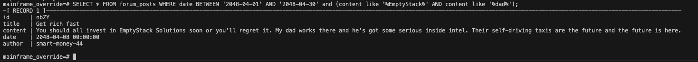
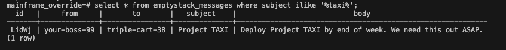

1. SQL query is written to find the forum post written in April 2048 that mentions EmptyStack and dad.
    SELECT * FROM forum_posts WHERE date BETWEEN '2048-04-01' AND '2048-04-30' and (content like '%EmptyStack%' AND content like '%dad%');
    
2. SQL query is written to find the first and last name of the forum post author.
    select * from forum_accounts where username like 'smart-money-44';
    
3. SQL query is written to find all accounts with the same last name.
    select * from forum_accounts where last_name like 'Steele';
    
4. SQL query is written to find all employees with the same last name.
    select * from emptystack_accounts where last_name like 'Steele';
    

node mainframe
Username: triple-cart-38
Password: password456
Welcome, triple-cart-38!
Loading messages and projects...
Your data has been loaded to emptystack.sql. Have a nice day!

5. SQL query is written to find employee message concerning the taxi project.
    select * from emptystack_messages where subject ilike '%taxi%';
    
6. SQL query is written to find the credentials of the admin account.
    select * from emptystack_accounts where username = 'your-boss-99';
    
7. SQL query is written to find the ID of the taxi project.
    SELECT * FROM emptystack_projects WHERE code = 'TAXI';
    

node mainframe -stop

WARNING: admin access required. Unauthorized access will be logged.
Username: your-boss-99
Password: notagaincarter
Welcome, your-boss-99.
Project ID: DczE0v2b
Initiating project shutdown sequence...
5...
4...
3...
2...
1...
Project shutdown complete.

